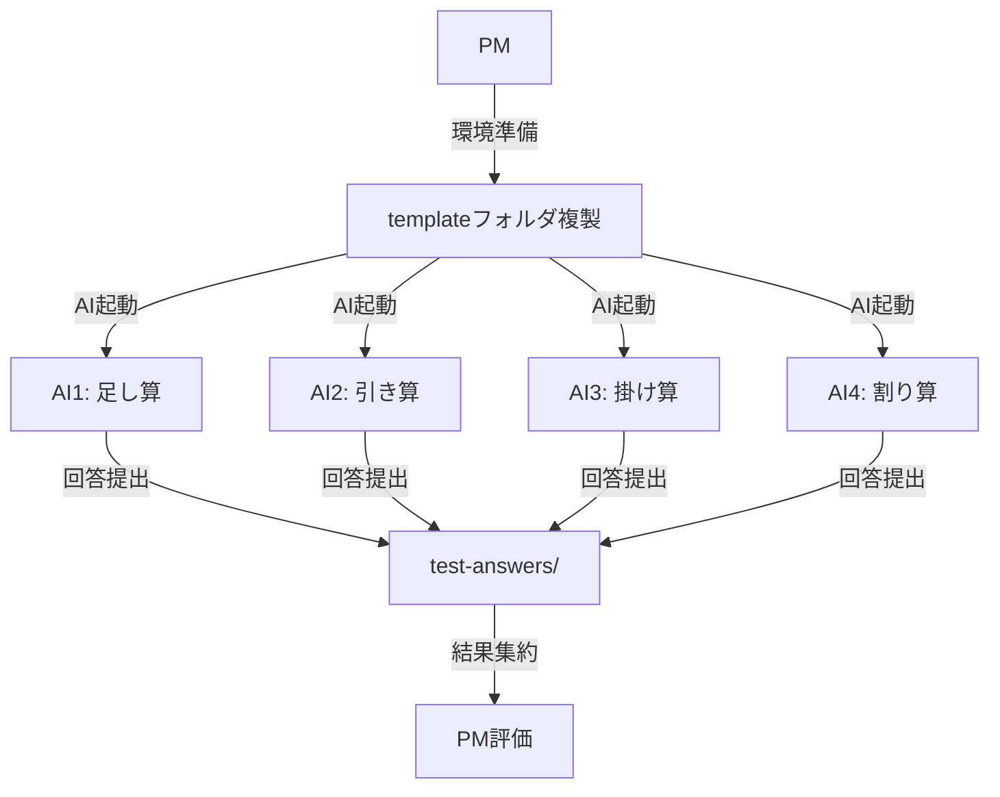

# AIテストランチャー - PM向けガイド

## 🎯 概要
複数AIインスタンスの独立評価システム。PMが全体管理を行う。

## 📊 実行フロー



## ⚡ クイック実行手順

1. **templateフォルダを作業用に複製**
2. **各AIに作業割り当て**
   - AI1-work/: 足し算担当
   - AI2-work/: 引き算担当
   - AI3-work/: 掛け算担当
   - AI4-work/: 割り算担当
3. **結果をtest-answers/に収集**

## 📂 構造
```
claude-test-100/
├── README.md                # このファイル
├── QUICK_START.md          # クイックスタートガイド
├── sample-test.txt         # サンプルテスト（簡単な数学問題）
├── auto-claude-start/      # 起動スクリプト
│   ├── test_launcher.ps1  # メインランチャースクリプト
│   └── README.md          # スクリプトの説明
├── test-answers/           # 結果保存フォルダ
│   └── sample-answer.txt  # サンプル回答
├── system/                 # システム設定（オプション）
│   └── CLAUDE.md          # AI運用ルール（参考）
└── workflows/              # ワークフロー図（参考）
    └── test-workflow.html # テスト実行フロー図
```

## 📦 含まれているもの
- **サンプルテスト**: 簡単な数学問題（1+1、2-1、3*3、4/2など）
- **テストランチャー**: テストを自動化するPowerShellスクリプト
- **結果保存**: 整理された回答の収集と管理

## ⚡ クイックスタート
**→ すぐに始める場合は [QUICK_START.md](./QUICK_START.md) を参照してください**

## 🌟 独自のテストを使用する場合
1. `sample-test.txt`を自分のテスト内容に置き換える
2. 必要に応じて`test_launcher.ps1`のパスを更新する
3. ランチャーを実行する
4. test-answersフォルダから結果を収集する

## 📝 実行可能なテストの例
- 論理パズル
- プログラミングチャレンジ
- 言語理解テスト
- 推論問題
- その他、あらゆるテキストベースの評価

## 📂 注意事項
数学問題は機能を実証するための単純な例に過ぎません。このツールは、提供するあらゆるテストコンテンツで動作するように設計されています。

### ⚠️ 重要な注意
**テスト実行時に生成されるファイル**：
- `window_process_log.txt` - 実行ログ（自動生成）
- `test_answer_*.txt` - 回答ファイル（自動生成）

これらのファイルはルートフォルダに生成される場合があります。定期的に削除またはtest-answersフォルダに移動してください。

### フォルダの説明
- **system/**: AI運用ルールなどのシステム設定ファイル。通常の使用では無視して構いません
- **workflows/**: テスト実行の流れを視覚化した参考資料。必要に応じて参照してください