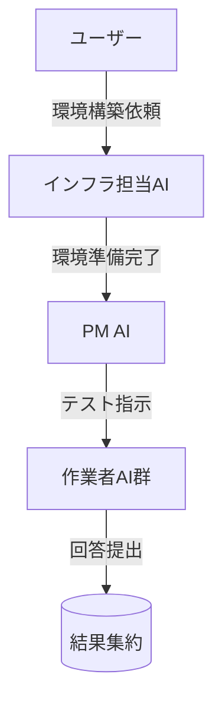

# AIテストランチャー フォルダ構成レビュー結果

**作成日時**: 2025年8月12日  
**レビュー対象**: /mnt/c/Users/user/Desktop/work/90_cc/20250812/claude-test-100/  

## 1. フォルダ構成の適切性評価

### ✅ 優れている点

1. **テンプレート化の設計**
   - `template/` フォルダによる再利用可能な構造
   - 各AI作業フォルダの明確な分離（AI1-work ~ AI4-work）
   - PM-work フォルダによる管理層の分離

2. **役割の明確な分離**
   - 各AIが独立したワークスペースを持つ設計
   - `test-answers/` による成果物の集約
   - `system/` による運用ルールの明文化

3. **運用ルールの体系化**
   - work_history.log による作業履歴の強制記録
   - reflection.md による振り返りの仕組み
   - フォルダ厳守ルールによるセキュリティ確保

### ⚠️ 改善が必要な点

1. **現在の構成不整合**
   - 提示された構成図と実際の構成が異なる
   - `template/README.md` が空ファイル（1行のみ）
   - templateフォルダ内にtest-answersが配置されているが、実運用時の配置が不明確

2. **スケーラビリティの限界**
   - AI1-AI4の固定構成（4人限定）
   - 100人規模への対応が構造的に困難

## 2. 改善提案

### A. フォルダ構成の修正案

```
claude-test-100/
├── README.md                    # PM向けプロジェクト概要
├── QUICK_START.md              
├── template/                    # 複製用テンプレート
│   ├── README.md               # テンプレート使用説明
│   ├── config/                 # 設定ファイル群
│   │   ├── test-config.json   # テスト設定
│   │   └── roles.json         # 役割定義
│   ├── workspaces/            # 作業スペーステンプレート
│   │   ├── PM-work/
│   │   └── AI-work-template/  # 動的複製用テンプレート
│   ├── shared/                # 共有リソース
│   │   ├── sample-test.txt
│   │   └── test-answers/      # 回答集約場所
│   ├── system/                # システム運用
│   │   ├── CLAUDE.md
│   │   └── monitoring/        # 監視・ログ
│   └── workflows/
│       └── test-workflow.html
├── instances/                 # 実際の作業インスタンス
│   ├── session-YYYYMMDD-HHMMSS/  # セッション別フォルダ
│   │   ├── PM-work/
│   │   ├── AI-001-work/       # 動的生成
│   │   ├── AI-002-work/
│   │   └── ...
│   └── archive/               # 過去セッション保管
├── tools/                     # ツール・スクリプト群
│   ├── auto-claude-start/
│   ├── session-manager/       # セッション管理
│   └── monitoring/           # 監視ツール
└── tmp/                      # 一時ファイル・ドキュメント
```

### B. スケーラビリティ対応

1. **動的フォルダ生成**
   ```powershell
   # セッション開始時に必要な数のAI-XXX-workフォルダを自動生成
   $aiCount = 100
   for ($i = 1; $i -le $aiCount; $i++) {
       $folderName = "AI-{0:D3}-work" -f $i
       New-Item -Path "$sessionPath\$folderName" -ItemType Directory
   }
   ```

2. **設定駆動型アプローチ**
   ```json
   {
     "test_session": {
       "ai_count": 100,
       "pm_count": 10,
       "test_timeout": 3600,
       "auto_archive": true
     }
   }
   ```

### C. ログ管理の強化

```
system/monitoring/
├── session-logs/              # セッション別ログ
├── error-logs/               # エラーログ
├── performance-logs/         # パフォーマンス監視
└── audit-logs/              # 監査ログ
```

## 3. ワークフロー図の統合提案

### 推奨: Mermaid形式での統合

`README.md` に以下のような形で埋め込み：



**理由**:
- GitHub/VSCode での視覚化サポート
- メンテナンス性の向上
- 単一ファイルでの管理

## 4. README階層構造の評価

### 現在の階層

| レベル | ファイル | 役割 | 評価 |
|--------|----------|------|------|
| 1 | `/README.md` | PM向け概要 | ✅ 適切 |
| 2 | `/template/README.md` | 全体説明 | ❌ 空ファイル |
| 3 | 各work/README.md | 役割別説明 | ⚠️ 内容要確認 |

### 改善提案

1. **階層2の充実化**
   ```markdown
   # テンプレート使用ガイド
   ## 新規セッション開始手順
   ## フォルダ構成の説明
   ## 設定ファイルのカスタマイズ
   ```

2. **階層3の標準化**
   - 役割別README雛形の作成
   - 必須記載項目の定義
   - 作業開始チェックリスト

## 5. 追加で必要な要素

### A. セッション管理機能
```
tools/session-manager/
├── new-session.ps1           # 新規セッション作成
├── archive-session.ps1      # セッション終了・アーカイブ
└── list-sessions.ps1        # セッション一覧表示
```

### B. 監視・アラート機能
```powershell
# 容量監視
if ((Get-WmiObject -Class Win32_LogicalDisk -Filter "DeviceID='C:'").FreeSpace -lt 100GB) {
    Write-Host "警告: 空き容量が100GB未満です" -ForegroundColor Red
    exit 1
}
```

### C. エラーハンドリング強化
```
system/error-handling/
├── common-errors.json        # よくあるエラーと対処法
├── recovery-scripts/         # 復旧スクリプト
└── escalation-rules.json    # エスカレーション規則
```

## 6. 実現可能性評価

### ✅ 実現可能な要素
- 基本的なフォルダ分離によるAI独立実行
- ログ管理とトレーサビリティ
- テンプレート化による再利用性

### ⚠️ 課題のある要素
- 100人規模での同時実行時のリソース管理
- Windows環境でのプロセス管理限界
- ネットワーク帯域とAPI制限

### 💡 推奨対応策
1. **段階的スケールアップ**: 10人 → 50人 → 100人
2. **リソース監視の強化**: CPU/メモリ/ディスク使用量監視
3. **フェイルセーフ機能**: 異常時の自動停止・復旧

## 7. 総合評価

**現在の構成**: B+ (75/100点)  
**改善後の想定**: A- (85/100点)

### 強み
- 基本設計思想が優秀
- 運用ルールが明確
- セキュリティ意識が高い

### 改善ポイント
- スケーラビリティの向上
- 自動化機能の強化
- 監視・復旧機能の充実

この構成により、**複数AIが独立してテストを実行し、PMが全体を管理する体制は十分実現可能**です。